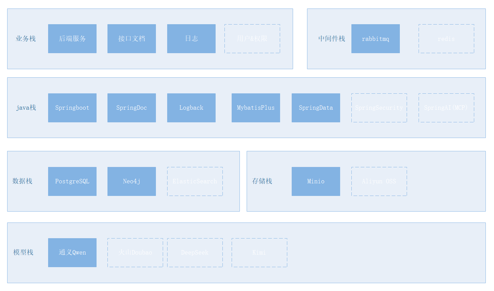
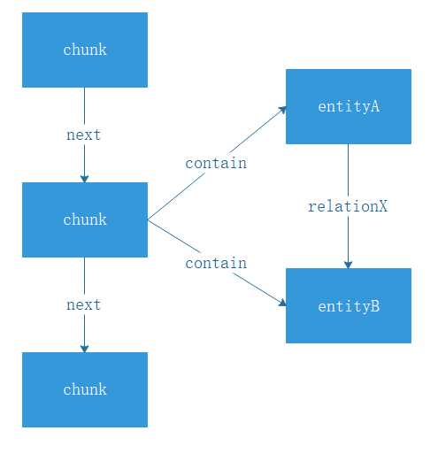

# Hex AI知识库后端服务
基于 Java + Neo4j 图数据库的企业级知识库后端服务，支持文本检索、向量检索、多路召回融合等核心能力，为企业提供高效的知识管理与检索解决方案。

✨ 项目特色

1.基于java语言，友好于不熟悉python又想学习搭建AI知识库的同学

2.使用图知识库neo4j作为底层技术实现，更加契合知识库的知识片段概念，并支持更加复杂的知识召回和检索

3.配套Docker容器技术，为新手提供完整的Docker部署方案，实现快速上线与水平扩展

4.基于开源组件搭建，学习&部署成本更低

> ⚠️ 重要提示
> 
> 当前项目处于初始开发阶段,代码优先推送至feature1分支,任何使用部署请切换至feature1,后续测试后会陆续更新至alpha分支及master.
>
> 项目初始阶段欢迎大家提交Issue||PR,或联系作者讨论.
>
> 商业使用请联系: 湖南云科智地网络科技有限公司

🛠️ 技术栈

虚线为目前未实现但后续会加入技术栈 组件可根据实际需求平移替换

🚀 快速开始

环境准备

Git , Java 21 , Docker , Maven

# 克隆项目
git clone https://github.com/hairuchen/hex.git

# 构建项目
cd /hex

docker build -t hex-backend-feature1:latest .

# 启动服务
docker compose up -d

# 项目详细介绍
图数据库架构如图:

其中Chunk(知识片段)后续称为Cnode,Entity(从Cnode原文抽象出的实体对象)后续称为Enode

对Enode查询有以下函数关系:
$$ f(\text{Enode}) = n\text{Cnode} $$
对某种Enode间关系x存在：
$$ f(\text{Rx}) => 2n\text{Enode} $$

本项目多路召回依赖于权重配置，因此无需重排模型。
相比于Ragflow,本服务没有切分方式等难以理解的概念，文件上传后会自动切分并按照上下文语义关联，无需关注于切分方式。

知识结构类似于以下:

🤝 贡献指南

联系作者Visualer

📄 许可证

本项目提供于学习与交流，如需商业使用请联系:

湖南云科智地网络科技有限公司

地址:中国-湖南省-长沙市-天心区-嘉盛国际广场1009

📞 作者联系方式

如有问题或建议，请通过以下方式联系作者:

提交 Issue
邮件:1252699590@qq.com