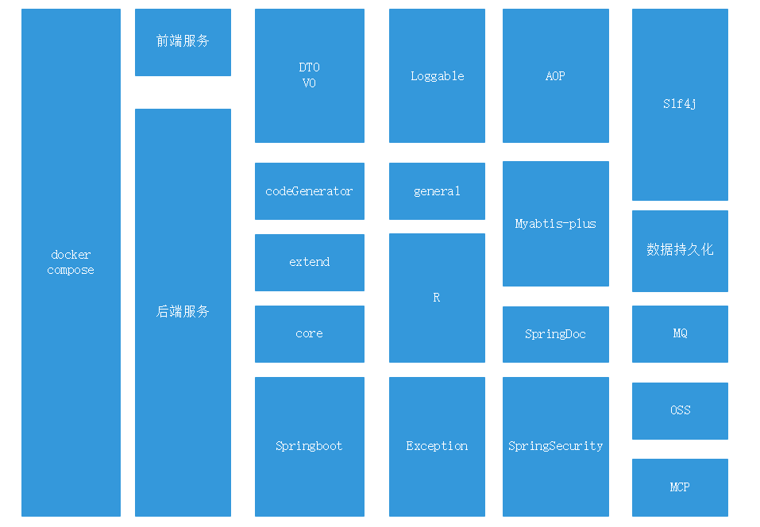
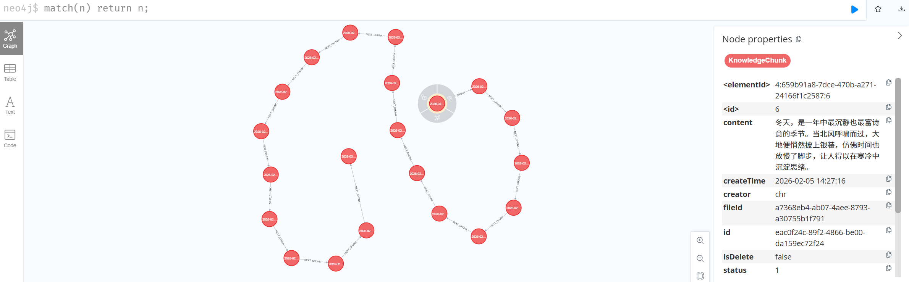
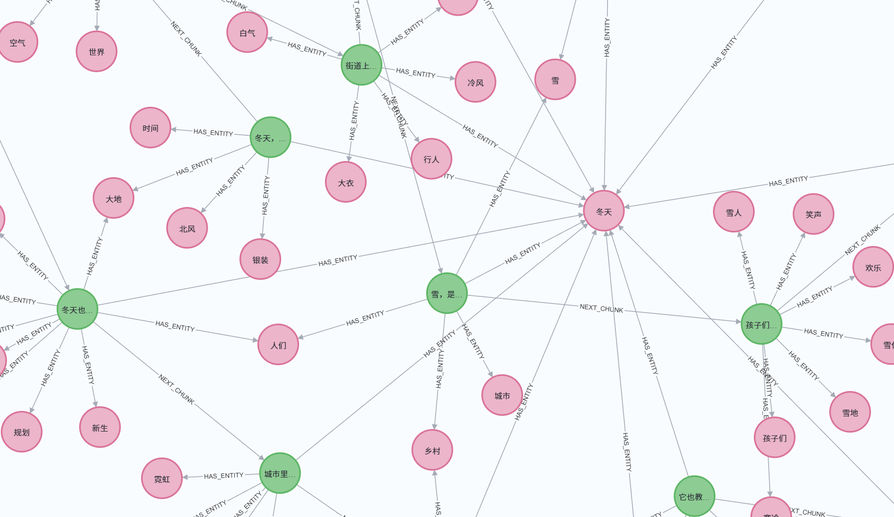

# Hex AI知识库服务
Hex AI 知识库服务是一款面向企业级场景打造的智能知识管理与检索系统，核心基于 Java 21 开发并深度融合 Neo4j 图数据库特性，突破传统知识库 “仅存储、弱关联” 的局限，首创性地将 AI 解析与图数据挖掘能力结合，让知识从 “静态存储” 升级为 “动态关联挖掘”。

✨ 核心能力

1.<b>多维度知识检索</b>：支持文本精准检索、向量相似度检索、知识路径关联检索，既能快速定位目标知识片段，也能通过图关系挖掘隐藏的知识关联；

2.<b>智能文档解析</b>：上传文档后自动完成文本切分、实体提取、向量生成，并基于 Neo4j 构建 Chunk-Entity 层级关联图谱，形成结构化知识网络；

3.<b>自动化知识挖掘</b>：依托图数据库的关系建模能力，自动挖掘知识片段间的上下文关联、实体归属关系，实现知识的 “主动推荐” 与 “路径溯源”；

4.<b>轻量化部署</b>：支持 Docker 容器一键部署，无需复杂环境配置，兼容企业级生产环境快速落地。

> ⚠️ 重要提示
> 
> 当前项目处于初始开发阶段,代码优先推送至feature1分支,任何使用部署请切换至feature1,后续测试后会陆续更新至alpha分支及master.
>
> 项目初始阶段欢迎大家提交Issue||PR,或联系作者讨论.
>
> 商业使用请联系: 湖南云科智地网络科技有限公司

🛠️ 技术栈

🚀 快速开始

环境准备

Git , Java 21 , Docker , Maven

## 部署

git clone https://github.com/hairuchen/hex.git

cd /hex

docker compose up -d --build

## 应用场景
- 企业内部知识库：将分散的文档、手册转化为结构化知识图谱，提升员工检索效率与知识复用率；
- 智能客服知识库：基于向量检索快速匹配用户问题与答案，结合实体关联挖掘拓展应答维度；
- 行业数据中台：对行业文档、报告进行实体与关系提取，构建行业知识图谱，支撑数据洞察与决策。

## 技术创新
区别于传统知识库仅聚焦 “存储与检索”，Hex AI 知识库的核心创新在于：
- 以 Neo4j 图数据库为底层，将知识拆分为 “Chunk（文本片段）-Entity（实体）-Relation（关系）” 三层结构，实现知识的精细化建模；
- 结合大模型（通义千问）完成非结构化文本的结构化解析，自动生成知识向量与关联关系，降低人工建模成本；
- 支持 “检索 - 挖掘 - 溯源” 全流程能力，不仅能找到目标知识，还能呈现知识的上下文关联与实体归属，形成完整的知识脉络。

Hex AI 知识库旨在让企业知识库从 “信息仓库” 升级为 “智能知识大脑”，通过 AI 与图数据库的双重赋能，释放隐藏在非结构化文档中的价值。
知识结构类似于以下:

🤝 贡献指南

联系作者Visualer

📄 许可证

本项目提供于学习与交流,如需商业使用请联系:

湖南云科智地网络科技有限公司

地址:中国-湖南省-长沙市-天心区-嘉盛国际广场1009

📞 作者联系方式

如有问题或建议,请通过以下方式联系作者:

提交 Issue
邮件:1252699590@qq.com